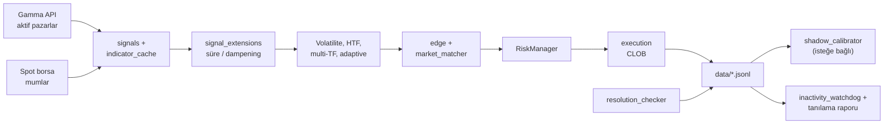

# polymarket-llm-bot

Polymarket tahmin piyasalarında (ör. BTC/ETH/SOL, 5m/15m) **teknik analiz** tabanlı sinyal üreten ve Polymarket CLOB üzerinden emir gönderen Rust botu. Spot mum verisi (varsayılan Binance), Gamma API ile pazar seçimi, RSI/MACD/momentum kümesi, isteğe bağlı küme oyu (cluster), volatilite / üst zaman dilimi (HTF) / çoklu zaman dilimi (multi-TF) / adaptif eşik ve yön cezası filtreleri, edge ve Kelly benzeri boyutlandırma ile **RiskManager** güvenlik sınırları birlikte çalışır.

İsteğe bağlı **shadow-to-live kalibrasyonu**: çözümlenmiş `shadow_trades.jsonl` verisinden asset bazlı parametre önerileri; runtime’da bellek içi override (`calibration_state.json` ile kalıcılık).

**Bakiye başlangıcı ve kalıcılık:** Canlı CLOB oturumu (`DRY_RUN=false` ve kimlik doğrulama başarılı): başlangıç bakiyesi CLOB **balance-allowance** (USDC) ile alınır; istek başarısızsa veya dry-run / auth düşüşü varsa `data/balance_state.json` veya `initial_balance` kullanılır (`resolve_starting_balance`). Çalışma sırasında bakiye `RiskManager` içinde güncellenir ve `balance_state.json` ile saklanır.

**Dinamik emir tabanı:** Kelly öncesi efektif minimum USDC, `min_order_usdc_floor` ile sabit tabanın üzerinde `balance × max_position_pct × 0.8` ile ölçeklenir; üst sınır `min_order_usdc` (`config.toml`: `min_order_usdc`, `min_order_usdc_floor`).

**İnaktivite tanılama:** Uzun süre trade yoksa veya çok sayıda `order_size_below_minimum` atlama tetiklenince WARN ve isteğe bağlı **`data/inactivity_report.json`** raporu (skip/shadow/gerçek trade/kalibrasyon özeti; parametre değiştirmez; her tetikte üzerine yazılır).

## Dizin yapısı (özet)

```
llm_bot/
├── Cargo.toml
├── config.toml              # Strateji (commitlenebilir örnek)
├── env.example              # Secret ve opsiyonel env anahtarları
├── README.md
├── data/                    # Çalışma zamanı JSONL/JSON (DATA_DIR, varsayılan: data/)
│   ├── trades.jsonl         # Gerçek / dry-run işlemler (+ çözüm güncellemesi)
│   ├── shadow_trades.jsonl  # Sinyal sonrası atlanan hayali işlemler (counterfactual)
│   ├── calibration_state.json  # Shadow kalibrasyon durumu (açıksa)
│   ├── balance_state.json   # RiskManager bakiyesi (otomatik yazılır)
│   ├── skip_reasons.jsonl     # Atlama telemetrisi (log_skip_decision)
│   ├── order_failures.jsonl   # Emir yerleştirme hataları (oluşunca)
│   └── inactivity_report.json  # Watchdog tetiklenince tanılama raporu (üzerine yazılır)
├── scripts/analysis/        # Python analiz yardımcıları (shadow/trades üzerinde)
└── src/
    ├── main.rs              # Binary: döngü, çözüm, shadow kalibrasyon, inaktivite watchdog
    ├── lib.rs               # Kütüphane modül ağacı
    ├── trading_loop.rs      # Tarama → sinyal → filtre → emir; CycleStats (trade/skip sayıları)
    ├── config.rs / config_toml.rs  # AppConfig, AssetStrategy, TOML şeması
    ├── shadow_calibrator.rs # Shadow istatistik, öneri motoru, rollback
    ├── inactivity_diagnostics.rs  # Watchdog sonrası JSON tanılama raporu
    ├── inactivity_watchdog.rs    # Uzun inaktivite / ardışık boyut skip uyarıları
    ├── adaptive.rs          # trades.jsonl tabanlı min_edge / min_confidence ve yön cezası
    ├── metrics.rs           # TradeRecord, JSONL yazma/okuma
    ├── resolution_checker.rs # CLOB ile çözüm; trades + shadow geriye yazma
    ├── gamma.rs             # Gamma API istemcisi
    ├── spot_price.rs        # Spot mum çekimi
    ├── signals.rs           # RSI, MACD, momentum, cluster
    ├── indicator_cache.rs   # Sinyal önbelleği
    ├── signal_extensions.rs # Süre / expiry dampening
    ├── edge.rs              # Edge, Kelly boyutlandırma
    ├── market_matcher.rs    # Soru metnine göre yön eşleme
    ├── risk.rs              # RiskManager, bakiye kalıcılığı
    ├── execution.rs         # CLOB emirleri
    ├── order_tracker.rs     # Bekleyen GTD emirleri, poll
    ├── fill_tracker.rs / user_ws.rs  # Dolgu takibi (canlı)
    ├── volatility.rs      # Volatilite rejim filtresi
    ├── types.rs             # Market, Direction, OpenPosition
    ├── constants.rs         # Sabitler (ör. min likidite varsayılanı)
    ├── telemetry.rs / prometheus_export.rs
    ├── backtest/mod.rs
    └── bin/
        ├── stats.rs
        └── backtest.rs
```

## Mimari (özet)



Canlı döngü (`trading_loop`) her pazar için: ön filtreler (likidite, fiyat bandı, süre, açık pozisyon) → yeterli mum → önbelleklenmiş teknik sinyal → momentum / MACD / volatilite → HTF → adaptif eşikler ve yön cezası → taker hizası → yön eşleme ve edge → RSI / boyut / risk → dry-run veya gerçek emir. Döngü sonunda `CycleStats` (yerleştirilen trade sayısı, `order_size_below_minimum` atlama sayısı) ana döngüye döner. Her döngü sonunda: açık pozisyon çözümü, ardından dosyadan `trades.jsonl` ve `shadow_trades.jsonl` geriye çözüm; `[shadow_calibration] enabled` ise `maybe_recalibrate` çalışır (shadow önerileri, son gerçek işlemlere göre **live veto** ile gevşetme tarafı filtrelenebilir). **İnaktivite watchdog:** uzun süre trade yoksa veya çok sayıda boyut tabanı atlama tetiklenince WARN ve bir kez **`data/inactivity_report.json`** tanılama raporu üretilir (`skip_reasons`, shadow, gerçek trade, kalibrasyon özeti; yapılandırma değiştirmez).

## Modül ve paket tablosu

| Parça | Rol |
|--------|-----|
| **`polymarket_llm_bot` (lib)** | Strateji, istemciler, analiz; `trading_loop` ana tarama döngüsü |
| **Binary `polymarket-llm-bot`** | `.env` (secret), `config.toml` (strateji), isteğe bağlı OpenTelemetry / Prometheus, sonsuz döngü |
| **`config` / `config_toml`** | `AppConfig`, `AssetStrategy`, `TomlRoot`; öncelik: **env > config.toml > kod varsayılanı** |
| **`trading_loop`** | Pazar listesi → filtre → mum → sinyal → filtre zinciri → emir; shadow counterfactual loglama (sinyal sonrası atlamalar); `CycleStats` ile istatistik |
| **`signals`** | Wilder RSI, MACD, momentum kümesi, spot hacim oranı; `TechnicalSignal` |
| **`indicator_cache`** | Aynı (asset, interval, mumlar) için sinyal yeniden kullanımı |
| **`signal_extensions`** | `MIN_SECS_TO_CLOSE`, `MAX_SECS_TO_CLOSE`, `EXPIRY_DAMPEN_LAST_SECS`, süre parse |
| **`volatility`** | Getiri std üzerinden rejim filtresi (`VolatilityFilterConfig`) |
| **`edge`** | Piyasa fiyatına karşı edge; Kelly benzeri pozisyon USDC |
| **`market_matcher`** | Soru metnine göre UP/DOWN piyasasında sinyal yönü |
| **`risk`** | Günlük kayıp limiti, pazar başına tek açık/rezervasyon; başlangıç bakiyesi canlıda CLOB **balance-allowance**, aksi halde `balance_state.json` / `initial_balance`; süreç içi bakiye dosyaya yazılır |
| **`adaptive`** | Son çözümlenmiş **gerçek** işlemlerden `min_edge` / `min_confidence` ve isteğe bağlı yön cezası (`trades.jsonl`) |
| **`shadow_calibrator`** | Çözümlenmiş **shadow** işlemlerden asset bazlı override önerisi; `calibration_state.json`; rollback (kötü canlı WR) |
| **`inactivity_watchdog`** | Uzun süre trade yok (~4 saat) veya çok sayıda ardışık `order_size_below_minimum` → WARN |
| **`inactivity_diagnostics`** | Watchdog tetiklenince `data/inactivity_report.json`: skip/shadow/gerçek trade özeti, saatlik skip, kalibrasyon snapshot, bakiye trendi; **yalnızca bilgi** |
| **`metrics`** | JSONL: işlemler, shadow, atlama nedenleri, emir hataları; `TradeRecord` şeması |
| **`resolution_checker`** | CLOB ile market çözümü; `trades.jsonl` / `shadow_trades.jsonl` satır güncelleme |
| **`gamma` / `spot_price`** | Gamma etkin pazarlar; Binance (vb.) mumlar |
| **`execution` / `order_tracker` / `fill_tracker` / `user_ws`** | Emir, GTD takip, WebSocket dolgu (canlı) |
| **`prometheus_export` / `telemetry`** | `/metrics`, OTLP, tracing |
| **`backtest`** | Kütüphane: çözülmüş işlemler üzerinde walk-forward / bootstrap |
| **Binary `stats`** | `trades.jsonl` özet istatistikleri |
| **Binary `backtest`** | Monte Carlo + walk-forward; filtre bayrakları |

## Veri dosyaları (`DATA_DIR`, varsayılan `data/`)

| Dosya | İçerik |
|--------|--------|
| **`trades.jsonl`** | Yerleştirilen işlemler; çözümde `outcome`, `pnl`, `resolved_at`; telemetri alanları; isteğe bağlı `calibration_version` (shadow kalibrasyon sürümü); `strategy_version` (`[strategy]` / `STRATEGY_VERSION`) |
| **`shadow_trades.jsonl`** | Sinyal üretildikten sonra filtre yüzünden atlanan **hayali** işlemler (sabit notional, `skip_reason`); çözüm ile PnL |
| **`calibration_state.json`** | Shadow kalibrasyon açıksa: asset başına son kalibrasyon, uygulanan override snapshot, rollback bayrağı; dosya düzeyinde `strategy_version` |
| **`skip_reasons.jsonl`** | Atlama telemetrisi (`log_skip_decision`): likidite, edge, RSI, boyut tabanı vb. |
| **`order_failures.jsonl`** | `place_order` hataları |
| **`balance_state.json`** | Son bilinen bakiye, zaman damgası ve `strategy_version`; her başlangıçta güncel değerle yazılır; CLOB’tan okuma yoksa veya dry-run’da önceki dosya / `INITIAL_BALANCE` kullanılır |
| **`inactivity_report.json`** | İnaktivite uyarısı sonrası tanılama özeti (her tetikte üzerine yazılır) |

**Not:** Yerel sıfırlama için `data/` içindeki JSONL ve kalıcı JSON dosyalarını silebilirsiniz; dizin boş kalabilir veya `data/.gitkeep` ile yer tutulur; bot ilk yazımında dosyaları yeniden oluşturur.

- **Girdi:** `shadow_trades.jsonl` içindeki çözümlenmiş satırlar (asset bazlı WR, PnL, telemetri dağılımları).
- **Çıktı:** Bellekte `AssetStrategy` alanlarına uygulanan override’lar; `config.toml` dosyası değişmez.
- **Kalıcılık:** `calibration_state.json`; süreç yeniden başlasa da dosyadan yüklenir.
- **Epoch (varsayılan):** en az 20 shadow trade; sonraki güncellemelerde ~1 saat cooldown ve shadow PnL’de ~10 USDC’lik mutlak değişim eşiği; canlı trade’lerde kötü performansta rollback.
- **Live veto:** Son N gerçek işlem (`trades.jsonl`, yapılandırılabilir pencere) için WR ve toplam PnL’ye bakılır; yeterli örneklemde kötü canlı performansta **yalnızca gevşetme** yönlü öneriler düşürülür (sıkılaştırma önerileri korunur). Tamamen shadow’a göre gevşeme ile canlı kayıp çakışırsa uyarı log’u üretilebilir.
- **Yön (YES/NO):** Canlı YES/NO win rate’e göre, zayıf tarafta `yes_confidence_penalty` / `no_confidence_penalty` **gevşetmesi** önlenir (eşikler `config.toml` / env).
- **Log:** Kalibrasyon uygulandığında satırda `live_wr`, `live_pnl`, `live_count`, `veto_active`, `overrides_direction` (`tighten` / `loosen` / `mixed` / `none`) yer alır.
- Ayrıntılı parametreler ve env önekleri: kökteki **`config.toml`** içinde `[shadow_calibration]` ve `SHADOW_CALIBRATION_*` — canlı veto için `SHADOW_CALIBRATION_LIVE_VETO_*` (bkz. `config.rs`).

## Kurulum

```bash
cp env.example .env
# `.env`: yalnızca secret'lar (private key, isteğe bağlı funder / Builder API)
# Strateji parametreleri: kökteki `config.toml` (repoda; commitlenebilir)

cargo build --release
cargo run --release
```

Varsayılan binary adı: `polymarket-llm-bot` (`Cargo.toml` içinde `default-run`).

### Yapılandırma: `config.toml` + `.env`

| Dosya | İçerik | Git |
|--------|--------|-----|
| **`config.toml`** | `[strategy]`, `[technical]`, `[cluster]`, `[volatility]`, `[risk]`, `[htf]`, `[adaptive]`, `[execution]`, `[asset.*]`, `[shadow_calibration]` | Evet (örnek değerler) |
| **`.env`** | `POLYMARKET_PRIVATE_KEY`, isteğe bağlı `FUNDER_ADDRESS`, `BUILDER_API_*` | Hayır (`.gitignore`) |

**Öncelik:** ortam değişkeni `>` `config.toml` `>` kod varsayılanı. Hızlı deneme için: `export MIN_EDGE=0.11` ile `config.toml` üzerine yazılır.

İsteğe bağlı: `CONFIG_PATH=/yol/ozel.toml` ile farklı bir TOML dosyası verilebilir.

## Dry run

`DRY_RUN=true` (varsayılan) iken gerçek emir gönderilmez; kararlar ve loglar üzerinden davranış doğrulanır.

## Canlı işlem

1. `DRY_RUN=false`
2. CLOB / imza / funder ayarlarını doğrula (`SIGNATURE_TYPE`, gerekiyorsa `FUNDER_ADDRESS`)
3. Küçük bakiye ile test et

## CLI araçları

| Komut | Açıklama |
|--------|----------|
| `cargo run --release` | Ana bot döngüsü |
| `cargo run --bin stats -- --data-dir data` | `trades.jsonl`: win rate, edge/confidence bucket, **RSI / vol / süre bucket’ları**, ortalama PnL |
| `cargo run --bin backtest -- data/trades.jsonl [iterasyon]` | Monte Carlo + walk-forward; isteğe bağlı `--asset`, `--direction`, `--min-edge` / `--max-edge`, `--min-rsi` / `--max-rsi` ile alt küme |

`trades.jsonl` satırlarına (yeni işlemlerde) RSI, MACD histogram, hacim oranı, küme yönü, Gamma YES fiyatı, likidite, kapanışa kalan süre, volatilite std, Kelly oranı, bakiye / günlük kayıp snapshot, HTF hizası, adaptif eşikler, multi-TF, sizing cap ve isteğe bağlı `calibration_version` yazılır; eski satırlar bu alanlar olmadan da okunur.

## `scripts/analysis/`

Kök `data/shadow_trades.jsonl` ve `trades.jsonl` üzerinde çalışan Python yardımcıları (volatilite, momentum, cluster TIE, süre bucket’ları, adaptive penalty, multi-TF, entry band analizi vb.). Detay için ilgili `.py` dosyalarının başlıklarına bakın.

## Gözlemlenebilirlik

- **OTLP:** `OTEL_EXPORTER_OTLP_ENDPOINT`, `OTEL_SERVICE_NAME` (ör. Jaeger / collector gRPC 4317)
- **JSON log:** `LOG_JSON=true`
- **Prometheus:** `METRICS_ENABLED=true`, `METRICS_BIND=127.0.0.1:9090` — `curl` ile `/metrics`
- **İnaktivite:** `WARN` seviyesinde watchdog mesajları; tetiklenince `data/inactivity_report.json` üretimi için `INFO`/`ERROR` logları

## CLOB ve SDK

Proje **polymarket-client-sdk** kullanır (`clob`, `gamma`, `ctf`).

- **`SIGNATURE_TYPE`:** EOA (varsayılan), Proxy veya Gnosis Safe; sayısal değer de desteklenir.
- **EOA:** Funder genelde cüzdanın kendisidir; `FUNDER_ADDRESS` boş bırakılabilir.
- **Proxy / Gnosis Safe:** SDK funder’ı CREATE2 ile türetebilir; gerekirse `FUNDER_ADDRESS` ile override.
- **Builder API:** `BUILDER_API_*` isteğe bağlı; normal işlem için zorunlu değildir.
- **Alım emirleri:** Bot, anlık likidite gerektirmeyen **GTD limit alım** kullanır (`end_date_ms` ile süre sınırı); `Cargo.toml` içinde **polymarket-client-sdk** (ör. 0.4.4) doğrudan kullanılır.

## Ortam değişkenleri (özet)

| Değişken | Varsayılan (özet) | Açıklama |
|----------|-------------------|----------|
| `ASSETS` | btc, eth | Taranacak varlıklar |
| `DURATIONS` | 5m, 15m | Pazar süre filtreleri |
| `GAMMA_TAG_ID` | 102127 | Gamma etkinlik etiketi |
| `MIN_EDGE` | 0.06 | Min \|teknik olasılık − piyasa\| farkı |
| `MIN_CONFIDENCE` | 0.70 | Min güven (0.5–1.0) |
| `MIN_ORDER_USDC` | 10 (örnek `config.toml`) | Min emir (USDC); Kelly tabanı için üst sınır |
| `MIN_ORDER_USDC_FLOOR` | 2 (örnek) | Dinamik tabanın alt sınırı (USDC); bkz. `edge` + `trading_loop` |
| `MIN_LIQUIDITY_USDC` / `[cluster] min_liquidity` | kod/`config` | Minimum Gamma likiditesi |
| `SPOT_EXCHANGE` | binance | Spot kaynağı |
| `CANDLE_INTERVAL` / `CANDLE_LOOKBACK` | 1m / 100 | Mum ayarları |
| `RSI_PERIOD`, `MACD_*` | 14, 12, 26, 9 | Gösterge periyotları |
| `VOLUME_MIN_RATIO` | (yok) | Hacim vetosu için eşik |
| `VOL_*` | — | Getiri std rejim filtresi; ayrıntı `env.example` |
| `MAX_POSITION_PCT` | 0.05 | İşlem başına bakiye üst sınırı |
| `DAILY_LOSS_LIMIT_PCT` | 0.10 | Günlük kayıp limiti oranı |
| `INITIAL_BALANCE` | `config.toml` ile uyumlu | Dry-run veya CLOB bakiye çekilemediğinde fallback; dosya yoksa kullanılır — öncelik sırası: canlıda CLOB → `balance_state.json` → bu değer |
| `CYCLE_SECS` | 60 | Tarama periyodu (saniye) |
| `DATA_DIR` | data | JSONL dizini |
| `HTF_*` | bkz. `env.example` | Üst zaman dilimi trend filtresi |
| `ADAPTIVE_THRESHOLDS` / `ADAPTIVE_TRADE_WINDOW` | false / 50 | Son **gerçek** işlemlere göre eşik ayarı |
| `SHADOW_CALIBRATION_*` | bkz. `config.toml` | Shadow kalibrasyonu (açıkken); `SHADOW_CALIBRATION_LIVE_VETO_*` canlı veto penceresi / WR–PnL eşikleri |

Tam env anahtar listesi için **`env.example`**; strateji alanları ve per-asset örnekleri için **`config.toml`** dosyasına bakın.

## Kalibrasyon (manuel)

- Uzun süre `DRY_RUN=true` ile çalıştırıp `skip_reasons.jsonl` ve loglardaki atlama nedenlerini inceleyin.
- `MIN_EDGE`, `MIN_CONFIDENCE`, mum ve gösterge parametrelerini kendi varlık/süre çiftinize göre ayarlayın.
- Pazar kapandıktan sonra çözüm gelince `trades.jsonl` satırları güncellenir (`outcome`, `pnl`, `resolved_at`).
- Shadow tabanlı otomatik parametre güncellemesi için **`[shadow_calibration]`** bölümünü kullanın (yukarıdaki bölüm); canlı işlem kalitesine bağlı veto ve yön denetimi için aynı bölümdeki `live_veto_*` ve `live_direction_veto_wr` alanlarına bakın.

## Lisans ve sorumluluk

Bu yazılım yatırım tavsiyesi değildir. Canlı işlem risklerini kendiniz değerlendirin; kayıplardan proje sorumlu tutulamaz.
