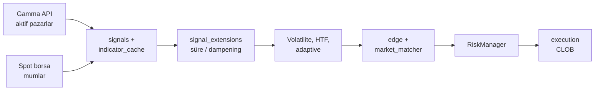

# polymarket-llm-bot

Polymarket tahmin piyasalarında (ör. BTC/ETH, 5m/15m) **teknik analiz** tabanlı sinyal üreten ve Polymarket CLOB üzerinden emir gönderen Rust botu. Spot mum verisi (varsayılan Binance), Gamma API ile pazar seçimi, RSI/MACD/momentum kümesi, isteğe bağlı küme oyu (cluster), volatilite / üst zaman dilimi (HTF) / adaptif eşik filtreleri, edge ve Kelly benzeri boyutlandırma ile **RiskManager** güvenlik sınırları birlikte çalışır.

## Mimari (özet)



Canlı döngü (`trading_loop`) her pazar için: likidite ve fiyat bantları → yeterli mum → önbelleklenmiş teknik sinyal → kapanışa yakın olasılık yumuşatma → volatilite → HTF hizası → adaptif eşikler → yön eşleme ve edge → günlük kayıp / pozisyon limitleri → dry-run veya gerçek emir.

## Modül ve paket tablosu

| Parça | Rol |
|--------|-----|
| **`polymarket_llm_bot` (lib)** | Strateji, istemciler, analiz; `trading_loop` ana tarama döngüsü |
| **Binary `polymarket-llm-bot`** | `.env` (secret), `config.toml` (strateji), isteğe bağlı OpenTelemetry / Prometheus, sonsuz döngü |
| **`signals`** | Wilder RSI, MACD, momentum kümesi, spot hacim oranı; `TechnicalSignal` |
| **`edge`** | Piyasa fiyatına karşı edge; Kelly benzeri pozisyon USDC |
| **`risk`** | Günlük kayıp limiti, pazar başına tek açık pozisyon |
| **`backtest`** | Kütüphane: çözülmüş işlemler üzerinde walk-forward / bootstrap |
| **`signal_extensions`** | `MIN_SECS_TO_CLOSE`, `MAX_SECS_TO_CLOSE`, `EXPIRY_DAMPEN_LAST_SECS`, süre parse |
| **`metrics`** | JSONL: işlemler, atlama nedenleri, emir hataları |
| **Binary `stats`** | `trades.jsonl` özet istatistikleri |
| **`prometheus_export`** | `GET /metrics` (isteğe bağlı) |

## Kurulum

```bash
cp env.example .env
# `.env`: yalnızca secret'lar (private key, isteğe bağlı funder / Builder API)
# Strateji parametreleri: kökteki `config.toml` (repoda; commitlenebilir)

cargo build --release
cargo run --release
```

Varsayılan binary adı: `polymarket-llm-bot` (`Cargo.toml` içinde `default-run`).

### Yapılandırma: `config.toml` + `.env`

| Dosya | İçerik | Git |
|--------|--------|-----|
| **`config.toml`** | `ASSETS`, `MIN_EDGE`, `SLIPPAGE_BPS`, `CLUSTER_TIE_MIN_EDGE_MULTIPLIER`, `MIN_MOMENTUM_5M_ABS`, `NEUTRAL_TAKER_EDGE_MULTIPLIER`, `BLOCKED_DIRECTION` (per-asset), `MAX_SECS_TO_CLOSE` (per-asset), risk, `[asset.btc]` vb. | Evet (örnek değerler) |
| **`.env`** | `POLYMARKET_PRIVATE_KEY`, isteğe bağlı `FUNDER_ADDRESS`, `BUILDER_API_*` | Hayır (`.gitignore`) |

**Öncelik:** ortam değişkeni `>` `config.toml` `>` kod varsayılanı. Hızlı deneme için: `export MIN_EDGE=0.11` ile `config.toml` üzerine yazılır.

İsteğe bağlı: `CONFIG_PATH=/yol/ozel.toml` ile farklı bir TOML dosyası verilebilir.

## Dry run

`DRY_RUN=true` (varsayılan) iken gerçek emir gönderilmez; kararlar ve loglar üzerinden davranış doğrulanır.

## Canlı işlem

1. `DRY_RUN=false`
2. CLOB / imza / funder ayarlarını doğrula (`SIGNATURE_TYPE`, gerekiyorsa `FUNDER_ADDRESS`)
3. Küçük bakiye ile test et

## CLI araçları

| Komut | Açıklama |
|--------|----------|
| `cargo run --release` | Ana bot döngüsü |
| `cargo run --bin stats -- --data-dir data` | `trades.jsonl`: win rate, edge/confidence bucket, **RSI / vol / süre bucket’ları**, ortalama PnL |
| `cargo run --bin backtest -- data/trades.jsonl [iterasyon]` | Monte Carlo + walk-forward; isteğe bağlı `--asset`, `--direction`, `--min-edge` / `--max-edge`, `--min-rsi` / `--max-rsi` ile alt küme |

`trades.jsonl` satırlarına (yeni işlemlerde) RSI, MACD histogram, hacim oranı, küme yönü, Gamma YES fiyatı, likidite, kapanışa kalan süre, volatilite std, Kelly oranı, bakiye / günlük kayıp snapshot, HTF hizası, adaptif eşikler ve sizing cap bilgisi yazılır; eski satırlar bu alanlar olmadan da okunur.

## Gözlemlenebilirlik

- **OTLP:** `OTEL_EXPORTER_OTLP_ENDPOINT`, `OTEL_SERVICE_NAME` (ör. Jaeger / collector gRPC 4317)
- **JSON log:** `LOG_JSON=true`
- **Prometheus:** `METRICS_ENABLED=true`, `METRICS_BIND=127.0.0.1:9090` — `curl` ile `/metrics`

## CLOB ve SDK

Proje **polymarket-client-sdk** kullanır (`clob`, `gamma`, `ctf`).

- **`SIGNATURE_TYPE`:** EOA (varsayılan), Proxy veya Gnosis Safe; sayısal değer de desteklenir.
- **EOA:** Funder genelde cüzdanın kendisidir; `FUNDER_ADDRESS` boş bırakılabilir.
- **Proxy / Gnosis Safe:** SDK funder’ı CREATE2 ile türetebilir; gerekirse `FUNDER_ADDRESS` ile override.
- **Builder API:** `BUILDER_API_*` isteğe bağlı; normal işlem için zorunlu değildir.

### `vendor/` klasörü neden var?

Crates.io’daki **polymarket-client-sdk** (şu an 0.4.4) içinde, **FAK/FOK market emirlerinde** maker/taker tutarlarının ondalık kesimi bazen CLOB API’sinin sabit limitlerini aşıyor; sonuç `POST /order` üzerinde **400** ve `invalid amounts` hatası. Bu, upstream’de [rs-clob-client#261](https://github.com/Polymarket/rs-clob-client/issues/261) ile bilinen bir durum.

Bu repoda `Cargo.toml` içinde **`[patch.crates-io]`** ile SDK’nın yerel bir kopyası (`vendor/polymarket-client-sdk`) kullanılıyor; yalnızca market emri tutar kesimi (`order_builder.rs`) düzeltilmiş. Derleme bu yolu **diskte bulmak zorunda** olduğundan `vendor/` silinirse `cargo build` başarısız olur (patch kaldırılana kadar).

**Ne zaman kaldırılabilir?** crates.io’da bu düzeltmeyi içeren **yeni bir SDK sürümü** yayınlandığında:

1. `Cargo.toml` içindeki `[patch.crates-io]` bloğunu silin.
2. `polymarket-client-sdk` sürümünü yeni sürüme yükseltin.
3. `vendor/polymarket-client-sdk` (ve isteğe bağlı `vendor/README.md`) klasörünü silin; `cargo build` ve `cargo test` ile doğrulayın.

Kısa teknik özet: [vendor/README.md](vendor/README.md).

## Ortam değişkenleri (özet)

| Değişken | Varsayılan (özet) | Açıklama |
|----------|-------------------|----------|
| `ASSETS` | btc, eth | Taranacak varlıklar |
| `DURATIONS` | 5m, 15m | Pazar süre filtreleri |
| `GAMMA_TAG_ID` | 102127 | Gamma etkinlik etiketi |
| `MIN_EDGE` | 0.06 | Min \|teknik olasılık − piyasa\| farkı |
| `MIN_CONFIDENCE` | 0.70 | Min güven (0.5–1.0) |
| `MIN_ORDER_USDC` | 5 | Min emir (USDC) |
| `SPOT_EXCHANGE` | binance | Spot kaynağı |
| `CANDLE_INTERVAL` / `CANDLE_LOOKBACK` | 1m / 100 | Mum ayarları |
| `RSI_PERIOD`, `MACD_*` | 14, 12, 26, 9 | Gösterge periyotları |
| `VOLUME_MIN_RATIO` | (yok) | Hacim vetosu için eşik |
| `VOL_*` | — | Getiri std rejim filtresi; ayrıntı `env.example` |
| `MAX_POSITION_PCT` | 0.05 | İşlem başına bakiye üst sınırı |
| `DAILY_LOSS_LIMIT_PCT` | 0.10 | Günlük kayıp limiti oranı |
| `INITIAL_BALANCE` | 200 | Risk hesapları için referans bakiye |
| `CYCLE_SECS` | 60 | Tarama periyodu (saniye) |
| `DATA_DIR` | data | JSONL dizini |
| `HTF_*` | bkz. `env.example` | Üst zaman dilimi trend filtresi |
| `ADAPTIVE_THRESHOLDS` / `ADAPTIVE_TRADE_WINDOW` | false / 50 | Son işlemlere göre eşik ayarı |

Tam env anahtar listesi için **`env.example`**; strateji alanları ve per-asset örnekleri için **`config.toml`** dosyasına bakın.

## Kalibrasyon

- Uzun süre `DRY_RUN=true` ile çalıştırıp `skip_reasons.jsonl` ve loglardaki atlama nedenlerini inceleyin.
- `MIN_EDGE`, `MIN_CONFIDENCE`, mum ve gösterge parametrelerini kendi varlık/süre çiftinize göre ayarlayın.
- Pazar kapandıktan sonra çözüm gelince `trades.jsonl` satırları güncellenir (`outcome`, `pnl`, `resolved_at`).

## Lisans ve sorumluluk

Bu yazılım yatırım tavsiyesi değildir. Canlı işlem risklerini kendiniz değerlendirin; kayıplardan proje sorumlu tutulamaz.
